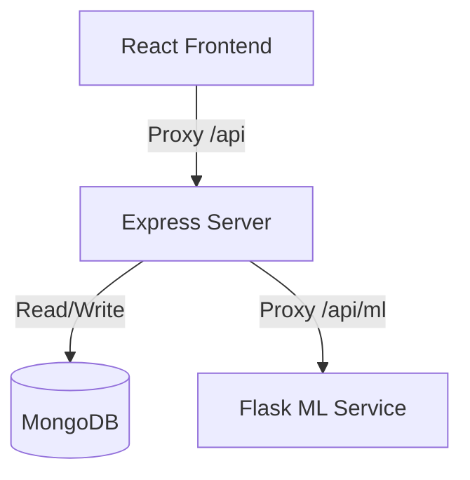

# AgroMitra 🌾
> **AgroMitra** is an intelligent, premium agricultural portal designed to empower farmers and rural merchants with AI-driven crop diagnostics, live market prices, and dynamic marketplace deals.

---

## 👥 Project Team
* **Raushan** — Frontend Lead (Designed the premium, high-fidelity responsive user interface with rich visual styling)
* **Vrishank** — Backend & ML Model Lead (Developed Express backend, data schemas, Razorpay checkout, and Flask ML classification engines)

---

## 🛠️ Technology Stack & Decoupled Architecture

AgroMitra is built using a modern decoupled microservices architecture:



* **Frontend**: React.js (v18), Bootstrap (v5), Custom CSS Styling (Harmonious palettes, glassmorphism, responsive navigation), and React Icons.
* **Express Backend**: Node.js, Express.js, MongoDB + Mongoose, JWT Authentication, and Passport session auth.
* **ML Microservice**: Python (v3.10), Flask, Scikit-Learn (RandomForest and label encoders), Pandas, and TF-IDF similarity vectorizers.
* **Payment Gateway**: Razorpay API Integration (Supports mock sandbox for development and real signature verification).

---

## ✨ Core Features & Technical Detail

### 1. 🌦️ Weather Predictions & Smart Advisories
- Uses a trained **RandomForestClassifier** to forecast weather trends (`Rain`, `Sun`, `Fog`, `Snow`, `Drizzle`) from inputs like precipitation, max/min temperature, and wind speed.
- Provides actionable agricultural advisories (e.g., advising against pesticide spraying before rain).

### 2. 🧪 AI Fertilizer Recommendation & Soil Testing
- Recommends optimal fertilizer blends (e.g., Urea, DAP, NPK variations) based on temperature, soil moisture, humidity, and NPK (Nitrogen, Phosphorus, Potassium) parameters.
- Integrates with the **Soil Sample Pickup Request** system. Admin logs findings directly to profiles, allowing farmers to import NPK data into the advisor tool with a single click.

### 3. 💰 Live Mandi Pricing (data.gov.in)
- Connects to the Indian government's Open Data portal.
- Implements a local JSON caching system with automatic self-healing fallback mechanisms to ensure high-speed loading of state and commodity prices.

### 4. 🎁 Government Schemes & Subsidies Matcher
- Contains a pre-trained **TF-IDF text similarity chatbot** answering user queries about government schemes, loans, and solar pumps.
- Includes a matcher engine scanning **80+ live schemes** (e.g., PM-Kisan, PM-KUSUM, Rythu Bandhu) to calculate a percentage eligibility score based on location, crop type, land acreage, and annual income.

### 5. 🛒 Dynamic Deals Shop
- Fully backed by a database `Product` model replacing static mocks.
- **Admin CRUD**: Admins can manage catalog inventory (add items, edit descriptions, adjust pricing, toggle stock status).
- **Checkout Prefill**: Automatically tracks and saves past addresses, letting buyers pick previous shipping info.

### 6. 🤝 Peer-to-Peer Crop Listings
- Allows farmers to list harvested crops for sale to merchants and local buyers.
- Dynamically fetches, filters, and manages listings via DB schemas using supported crop classifications.

---

## 🔌 API Endpoints Reference

### 🌐 Express Backend API (`port 5000`)

#### 🔑 Authentication & Signup (`/api/auth`)
* `POST /signup` — Register a new account.
  - **Body**: `{ name, email, phno, password, role }` (Roles: `Farmer`, `customer`)
* `POST /signin` — Sign in with credentials.
  - **Body**: `{ email, password }`
  - **Response**: `{ token, user: { username, email, role, banned } }`
* `GET /api/dashboard` — Get logged-in user details and recent activity logs. *(Auth required)*

#### 📦 Product Catalog & Shopping (`/api/products` & `/api/payment`)
* `GET /api/products` — Retrieve list of in-stock products. *(Auth required)*
* `POST /api/payment/order` — Initialize a payment order with Razorpay. *(Auth required)*
  - **Body**: `{ amount, purpose }`
* `POST /api/payment/verify` — Verify Razorpay signature and save the order to the database. *(Auth required)*
  - **Body**: `{ razorpay_order_id, razorpay_payment_id, razorpay_signature, items, amount, shippingDetails }`
* `GET /api/payment/my-orders` — Get order history for the logged-in customer. *(Auth required)*

#### 🌾 Crop Listings & Mandi Prices (`/api/crops`)
* `GET /api/crops` — Fetch active peer-to-peer crop listings. *(Auth required)*
* `POST /api/crops` — Publish a crop or seed listing for sale. *(Auth required)*
  - **Body**: `{ cropName, category, quantity, price, farmerName, farmerPhone }` (Matches allowed crop keywords)
* `GET /api/crops/mandi-prices` — Fetch live agricultural market prices from cache or government API. *(Auth required)*
  - **Query**: `?state=Punjab&commodity=Wheat`
* `GET /api/crops/mandi-states` — Fetch states currently in cache. *(Auth required)*

#### 🌱 Soil Testing Services (`/api/soil`)
* `POST /api/soil/request` — Book a soil sample pickup slot. *(Auth required)*
  - **Body**: `{ collectionDate, address }`
* `GET /api/soil/history` — Get history of soil reports and requests for the logged-in user. *(Auth required)*

#### 🛠️ Administrative Console (`/api/admin`) *(Admin Auth Required)*
* `GET /api/admin/users` — List all registered users.
* `PUT /api/admin/users/:id/ban` — Ban or unban a user.
* `GET /api/admin/logs` — Fetch security audit logs and active analytic sessions.
* `GET /api/admin/soil-requests` — Get all booked soil sample pickups.
* `PUT /api/admin/soil-requests/:id` — Upload NPK test results and complete soil request.
  - **Body**: `{ status: 'Completed', nitrogen, phosphorous, potassium, ph, moisture, soilType, cropType, remarks }`
* `GET /api/admin/orders` — List all shop transactions and orders. (Runs self-healing log scanner sync)
* `PUT /api/admin/orders/:id` — Update order status.
  - **Body**: `{ status: 'Processing' | 'Shipped' | 'Delivered' | 'Cancelled' }`
* `GET /api/admin/products` — Retrieve all catalog products (including out-of-stock).
* `POST /api/admin/products` — Create a new shop product.
  - **Body**: `{ name, category, price, oldPrice, image, description, inStock }`
* `PUT /api/admin/products/:id` — Edit an existing product's details.
* `DELETE /api/admin/products/:id` — Delete a product.

---

### 🧠 Python Flask ML Microservice API (`port 5050`)
*(Proxied via Express under `/api/ml/*`)*

#### 🌦️ Predict Weather (`POST /predict/weather`)
- **Body**:
  ```json
  {
    "precipitation": 12.5,
    "temp_max": 28.0,
    "temp_min": 18.0,
    "wind": 5.4
  }
  ```
- **Response**:
  ```json
  {
    "prediction": "Rain",
    "advice": "Heavy rainfall predicted. Postpone spraying pesticides..."
  }
  ```

#### 🧪 Predict Fertilizer Suggestion (`POST /predict/fertilizer`)
- **Body**:
  ```json
  {
    "temperature": 27.0,
    "humidity": 65.0,
    "moisture": 38.0,
    "soil_type": "Loamy",
    "crop_type": "Wheat",
    "nitrogen": 42.0,
    "phosphorous": 35.0,
    "potassium": 30.0
  }
  ```
- **Response**:
  ```json
  {
    "recommendation": "NPK 19-19-19",
    "guidelines": "NPK provides complex balanced nutrients. Mix with soil before sowing..."
  }
  ```

#### 🎁 Match Subsidies Eligibility (`POST /predict/subsidies`)
- **Body**:
  ```json
  {
    "state": "Telangana",
    "crop": "Rice",
    "land_acres": 4.2,
    "income": 250000
  }
  ```
- **Response**:
  ```json
  {
    "subsidies": [
      {
        "scheme": "Rythu Bandhu",
        "subsidy_amount": 10000,
        "category": "Finance",
        "description": "Rs 10000 per acre per year as investment support...",
        "match_percentage": 100,
        "is_eligible": true
      }
    ]
  }
  ```

#### 🤖 NLP Chatbot Q&A (`POST /query/subsidy` & `POST /query/website`)
- **Body**: `{ "query": "how to apply for solar pump subsidy" }`
- **Response**:
  ```json
  {
    "question": "What is the PM-KUSUM Solar Pump Scheme and how do I apply?",
    "answer": "PM-KUSUM Component B provides a 60% combined subsidy...",
    "score": 0.82
  }
  ```

#### 🔄 Retrain Website FAQ Chatbot (`POST /retrain`)
- Re-vectorizes the website FAQ search engine index from the Express database approved queries. Returns count of items trained.

---

## ⚙️ Setup & Installation

### Step 1: Install Dependencies
```bash
# Install Express server dependencies
cd server
npm install

# Install React client dependencies
cd ../client
npm install

# Install ML service requirements
cd ../ml_service
pip install -r requirements.txt
```

### Step 2: Start the ML Service
```bash
cd ml_service
python app.py
# Runs Flask server locally on port 5050
```

### Step 3: Start the Express Backend
```bash
cd server
node index.js
# Runs Express backend locally on port 5000 (also seeds default products and FAQs)
```

### Step 4: Start the Frontend Client
```bash
cd client
npm start
# Launches React dev server locally on port 3000
```
*(Or build static assets via `npm run build` inside `client/` to let the Express server serve it directly on port 5000).*

---

## 🔒 Security & Git Hygiene
Sensitive variables, local credentials, Python caches (`__pycache__`), and production build folders are ignored project-wide via root and local `.gitignore` modules. Never commit files containing raw JWT keys or credentials.